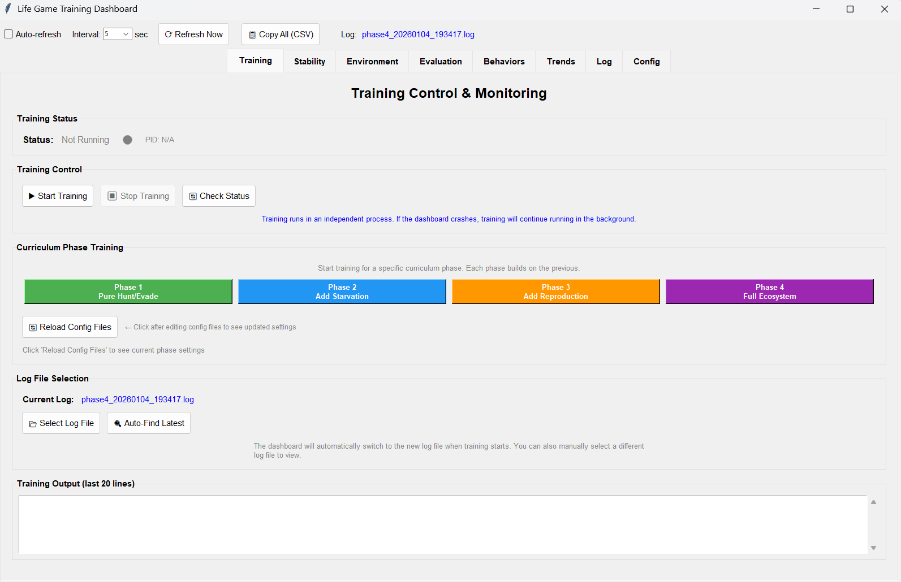
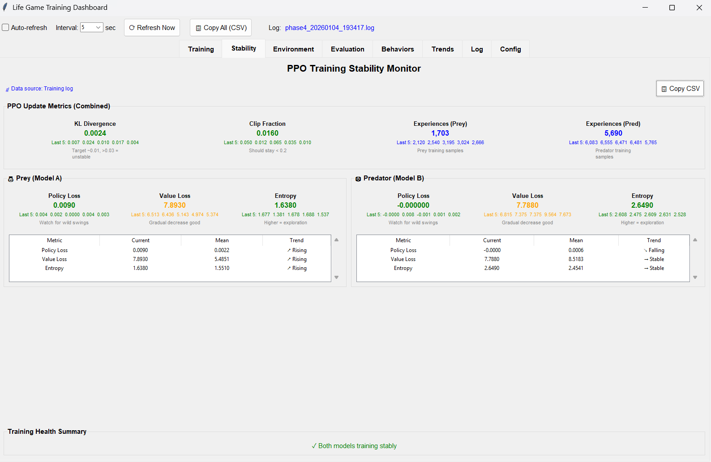
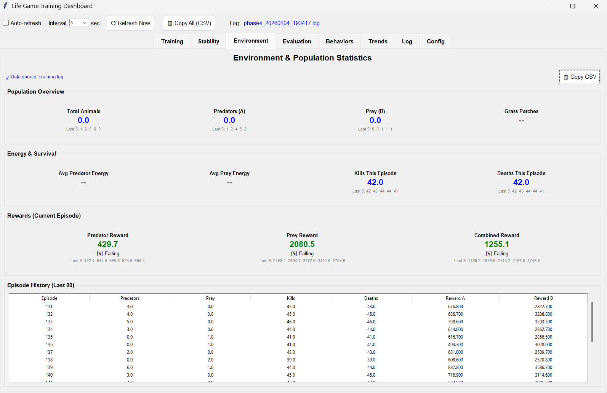
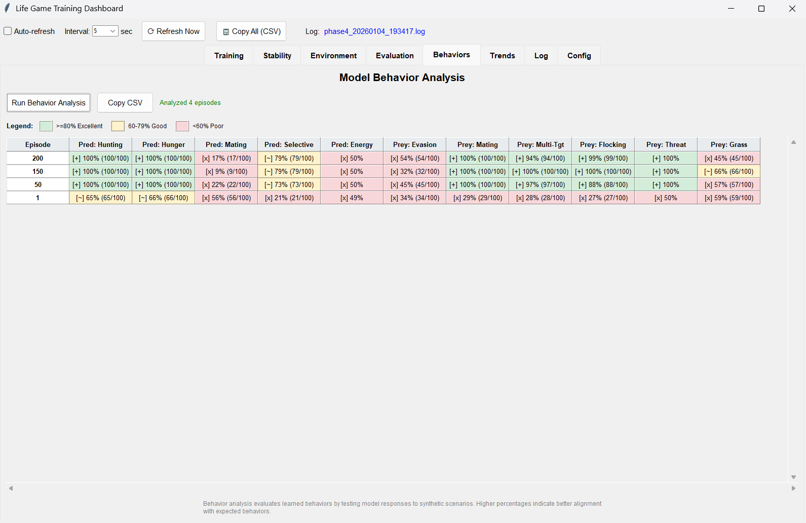
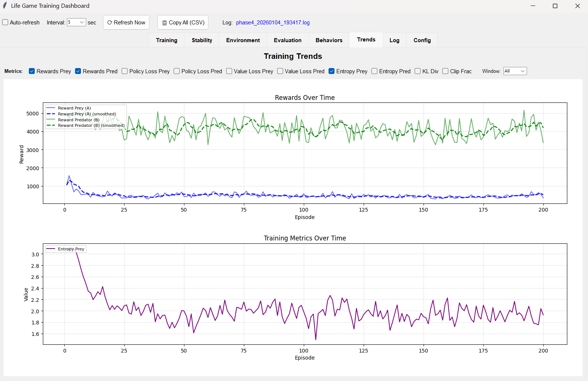
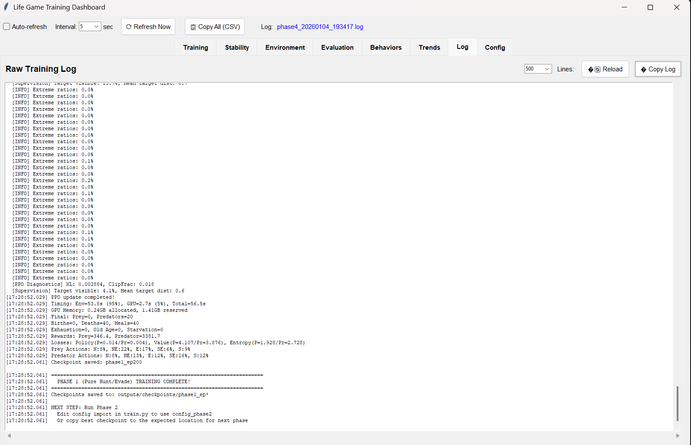
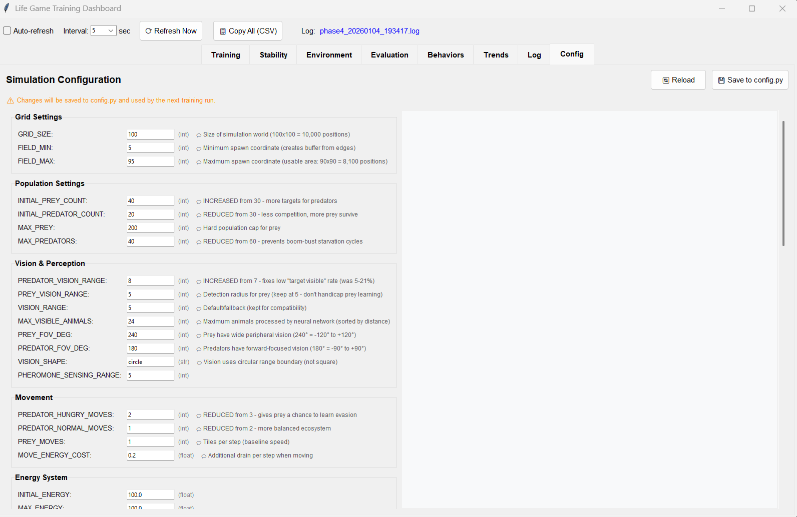
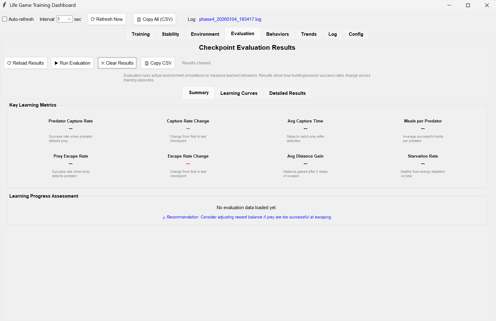

# Dashboard Application User Guide

**Training monitoring and control center for the RL system**

---

## Overview

The Dashboard application provides real-time monitoring of training progress, allows controlling training phases, and displays comprehensive metrics for evaluating model performance. It automatically refreshes to show the latest training status.

**To launch:**
- Double-click `Dashboard.vbs` in the project root, or
- Run `python scripts/run_dashboard.py`


*Screenshot: Dashboard main window*

---

## Table of Contents
- [Getting Started](#getting-started)
- [Auto-Refresh System](#auto-refresh-system)
- [Training Tab](#training-tab)
- [Stability Tab](#stability-tab)
- [Environment Tab](#environment-tab)
- [Behaviors Tab](#behaviors-tab)
- [Trends Tab](#trends-tab)
- [Log Tab](#log-tab)
- [Config Tab](#config-tab)
- [Evaluation Tab](#evaluation-tab)
- [Tips & Tricks](#tips--tricks)

---

## Getting Started

### Prerequisites
- Python environment with required packages
- Training should be running or have generated log files

### First Launch
1. Launch the dashboard application
2. Dashboard automatically detects training logs in `outputs/logs/`
3. If training is running, metrics update in real-time

---

## Auto-Refresh System

Located at the top of the window:

| Control | Function |
|---------|----------|
| **Auto** checkbox | Enable/disable automatic refresh |
| **Interval** dropdown | Refresh rate (1, 2, 5, 10, 30 seconds) |
| **🔄 Refresh Now** | Manual refresh button |
| **📊 Export CSV** | Export all metrics to CSV file |

### Refresh Behavior
- When enabled, automatically reads latest log files
- Updates all tabs with new data
- Status bar shows last update time

### Exporting Data
1. Click **📊 Export CSV**
2. Choose filename and location
3. Opens a summary of all training metrics
4. Useful for spreadsheet analysis or reports

---

## Training Tab

Control and monitor the training process.

### Phase Selection

The curriculum uses 4 training phases:

| Phase | Focus | Config File |
|-------|-------|-------------|
| **Phase 1** | Basic movement | `config_phase1.py` |
| **Phase 2** | Predator chase/Prey flee | `config_phase2.py` |
| **Phase 3** | Complex behaviors | `config_phase3.py` |
| **Phase 4** | Full ecosystem | `config_phase4.py` |

### Training Controls

| Button | Action |
|--------|--------|
| **▶ Start Phase X** | Begin training the selected phase |
| **⏹ Stop** | Gracefully stop training |
| **🔄 Switch Phase** | Change to different phase config |

### Current Status Panel
- **Phase**: Currently active training phase
- **Episode**: Current episode number
- **Total Steps**: Steps completed in current episode
- **Reward**: Running reward average
- **Training Time**: Elapsed training time

### Progress Indicators
- **Episode Progress Bar**: Steps within current episode
- **Phase Progress Bar**: Episodes within current phase

### Checkpoint Management
- **Latest Checkpoint**: Shows most recent saved model
- **Auto-save Every**: Episodes between checkpoints
- **Manual Save**: Force immediate checkpoint save

---

## Stability Tab

Monitor training stability and detect anomalies.


*Screenshot: Stability metrics and charts*

### Key Metrics

| Metric | Good Range | Warning Signs |
|--------|------------|---------------|
| **Policy Loss** | Decreasing trend | Spikes or divergence |
| **Value Loss** | Decreasing trend | Increasing consistently |
| **KL Divergence** | < 0.02 | > 0.05 indicates instability |
| **Entropy** | Gradually decreasing | Collapse to 0 = overfit |
| **Gradient Norm** | Stable or decreasing | > 1.0 suggests explosion |

### Stability Charts
- **Loss History**: Policy and value loss over episodes
- **KL Divergence**: Should stay within bounds
- **Entropy Decay**: Gradual reduction is healthy

### Alert System
- 🟢 **Green**: Metrics in healthy range
- 🟡 **Yellow**: Approaching warning thresholds
- 🔴 **Red**: Requires attention

### What to Do When Red
1. Check Gradient Norm - if > 1.0, reduce learning rate
2. Check KL Divergence - if > 0.05, reduce `ppo_epochs`
3. Check Entropy - if near 0, increase `entropy_coef`
4. Consider reverting to earlier checkpoint

---

## Environment Tab

Monitor ecosystem health and balance.


*Screenshot: Environment statistics*

### Population Metrics
- **Avg Prey**: Mean prey count per episode
- **Avg Predators**: Mean predator count per episode
- **Population Variance**: Stability of populations
- **Extinction Events**: Times a species hit 0

### Food Chain Balance
- **Prey Birth Rate**: Prey reproduction rate
- **Prey Death Rate**: Combined predation + starvation
- **Predator Hunt Success**: % of hunts resulting in meal
- **Starvation Rate**: Deaths from hunger

### Population Charts
- **Population Over Time**: Prey vs predator trends
- **Birth/Death Ratio**: Should stabilize near 1.0

### Healthy Ecosystem Signs
- ✅ Both populations stable (not trending to extinction)
- ✅ Predator population < Prey population
- ✅ Hunt success rate 10-40%
- ✅ Low starvation rates

### Unhealthy Signs
- ❌ Prey going extinct (predators too effective)
- ❌ Predators starving (prey too evasive)
- ❌ Wild population swings
- ❌ One species dominates completely

---

## Behaviors Tab

Track learned behavioral patterns.


*Screenshot: Behavior analysis*

### Predator Behaviors

| Behavior | Description | Target |
|----------|-------------|--------|
| **Chase Accuracy** | Directional correctness toward prey | > 70% |
| **Intercept Attempts** | Cutting off prey escape | > 30% |
| **Group Hunting** | Coordinated multi-predator hunts | Phase 4+ |
| **Energy Management** | Resting when not hungry | > 50% |

### Prey Behaviors

| Behavior | Description | Target |
|----------|-------------|--------|
| **Flee Accuracy** | Moving away from predators | > 80% |
| **Threat Detection** | Noticing nearby predators | > 60% |
| **Pheromone Response** | Reacting to danger signals | > 50% |
| **Grazing Efficiency** | Finding and eating grass | > 40% |

### Behavior Charts
- **Action Distribution**: What actions each species takes
- **Directional Accuracy**: How well agents move toward goals
- **Response Time**: Steps to react to threats

### Learning Progress
Early phases show random behavior (50% accuracy).
As training progresses:
- Phase 1: Basic movement improves
- Phase 2: Chase/flee accuracy increases  
- Phase 3: Complex behaviors emerge
- Phase 4: Full behavioral repertoire

---

## Trends Tab

Long-term training trend analysis.


*Screenshot: Training trends over time*

### Reward Trends
- **Episode Rewards**: Per-episode total reward
- **Rolling Average**: Smoothed reward trend (50 episodes)
- **Best Reward**: Peak performance achieved

### Performance Trends
- **Episode Length**: How long episodes last
- **Meals Per Episode**: Predator hunting success
- **Survival Time**: How long prey survive

### Trend Analysis

| Trend | Meaning | Action |
|-------|---------|--------|
| **Increasing reward** | Learning progressing | Continue training |
| **Flat reward** | Possible plateau | Try new phase or adjust LR |
| **Decreasing reward** | Regression | Check for instability |
| **High variance** | Inconsistent learning | Increase batch size |

### Trend Charts
- **Moving Average Window**: Adjust smoothing (10-100 episodes)
- **Comparison Mode**: Overlay multiple training runs
- **Phase Markers**: Vertical lines showing phase transitions

---

## Log Tab

Raw training log viewer.


*Screenshot: Raw log viewer*

### Log Display
- Shows real-time training output
- Scrollable text area
- Auto-scrolls to latest entries (toggle available)

### Log Controls
- **📁 Open Log File**: Select different log file
- **🔍 Filter**: Search/filter log entries
- **📋 Copy Selection**: Copy selected text
- **🗑️ Clear**: Clear display (not file)

### Log Entry Format
```
[2024-01-15 14:32:01] Episode 500 | Reward: 2847.3 | Steps: 1000
  Prey: 45 | Predators: 12 | Meals: 8 | Births: 23
  Policy Loss: 0.0234 | Value Loss: 0.0891 | KL: 0.0089
```

### Using Logs for Debugging
1. Look for error messages (red text)
2. Check for NaN values (indicates numerical instability)
3. Monitor GPU memory warnings
4. Track checkpoint save confirmations

---

## Config Tab

View current training configuration.


*Screenshot: Configuration viewer*

### Configuration Sections

**Training Hyperparameters**
- Learning rate, batch size, PPO epochs
- Discount factor (gamma), GAE lambda
- Entropy coefficient, value loss coefficient

**Environment Settings**
- Grid size, max steps per episode
- Initial populations
- Spawn rates and limits

**Reward Shaping**
- Reward weights for different events
- Penalty values
- Bonus conditions

### Phase Comparison
- View differences between phase configs
- Highlighted changes when switching phases
- History of configuration changes

### Modifying Config
1. Edit the appropriate `config_phaseX.py` file
2. Click **🔄 Reload Config** in dashboard
3. Restart training for changes to take effect

---

## Evaluation Tab

Run and view evaluation metrics.


*Screenshot: Evaluation results*

### Running Evaluation
1. Click **▶ Run Evaluation**
2. Select checkpoint to evaluate
3. Choose number of evaluation episodes
4. Wait for completion

### Evaluation Metrics

| Category | Metrics |
|----------|---------|
| **Population** | Final prey/predator counts, extinctions |
| **Hunting** | Meals, capture rate, pursuit accuracy |
| **Survival** | Avg lifespan, starvation rate |
| **Behavior** | Directional accuracy, response times |

### Results Table
- Sortable columns
- Compare multiple checkpoints
- Export to CSV for external analysis

### Evaluation vs Training
- **Training metrics**: Noisy, include exploration
- **Evaluation metrics**: Deterministic, true performance
- Run evaluation periodically to assess real progress

---

*For running trained models, see the [Demo Guide](Demo_Guide.md)*

*For understanding metrics, see the [Monitoring Guide](Monitoring_Guide.md)*
